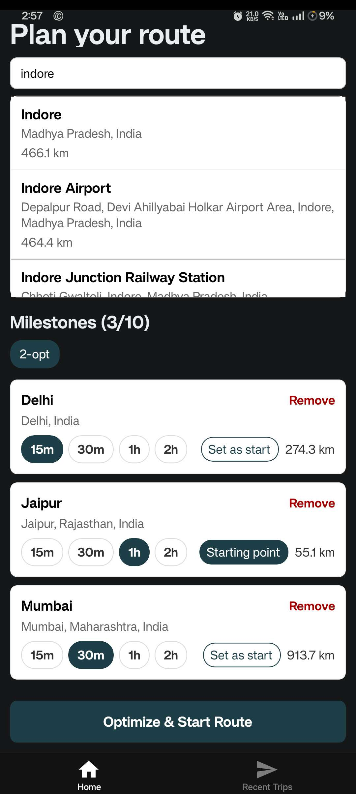
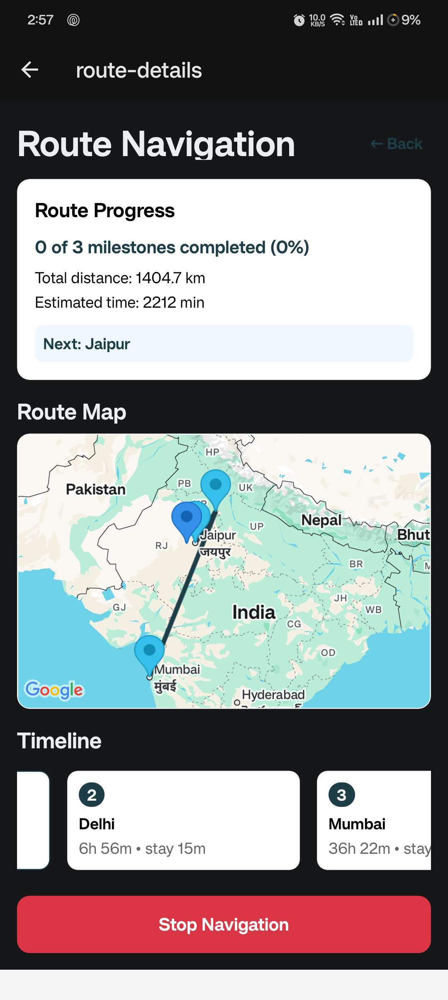

# Route Planner App 🗺️

A React Native/Expo application for intelligent route planning and optimization. Plan multi-stop routes with advanced optimization algorithms and real-time location tracking.


## 📱 Features

- **Smart Route Planning**: Add multiple destinations and get optimized routes
- **Advanced Optimization**: Uses Nearest Neighbor and 2-opt algorithms for efficient routing
- **Real-time Location**: GPS tracking and location-based services
- **Recent Trips**: Save and revisit previously planned routes
- **Interactive Maps**: Google Maps integration with custom markers and route visualization
- **Drag & Drop Interface**: Reorder destinations with intuitive drag-and-drop
- **Distance Calculation**: Accurate distance and time estimation using Haversine formula

## 🚀 Screenshots

| Home Screen | Recent Trips | Route Details |
|-------------|--------------|---------------|
|  |  |  |

*Plan your route with smart suggestions* | *View and manage saved trips* | *Navigate with interactive maps*

## 🛠️ Setup and Installation

### Prerequisites

- **Node.js** (v16 or later)
- **npm** or **yarn**
- **Expo CLI**: `npm install -g @expo/cli`
- **Android Studio** (for Android development)
- **Xcode** (for iOS development - macOS only)

### Quick Start

1. **Clone the repository**
   ```bash
   git clone <repository-url>
   cd route-planner
   ```

2. **Install dependencies**
   ```bash
   npm install
   ```

3. **Set up environment variables**
   ```bash
   cp env.example .env
   ```

4. **Configure API keys** (see [API Setup](#-api-key-setup) section)

5. **Start the development server**
   ```bash
   npx expo start
   ```

6. **Run on device/simulator**
   - Press `i` for iOS simulator
   - Press `a` for Android emulator  
   - Scan QR code with Expo Go app for physical device

## 🔑 API Key Setup

### Google Cloud Platform Setup

1. **Create a Google Cloud Project**
   - Go to [Google Cloud Console](https://console.cloud.google.com/)
   - Create a new project or select an existing one
   - Note your project ID

2. **Enable Required APIs**
   Navigate to APIs & Services → Library and enable:
   - **Maps SDK for Android**
   - **Maps SDK for iOS** 
   - **Places API**
   - **Geocoding API**
   - **Directions API**

3. **Create API Credentials**
   - Go to APIs & Services → Credentials
   - Click "Create Credentials" → "API Key"
   - Copy the generated API key

4. **Configure API Key Restrictions** (Recommended)
   - Click on your API key to edit
   - **Application restrictions**: Add your app's package name (`com.dax523.routeplanner`)
   - **API restrictions**: Select only the APIs listed above
   - Save changes

5. **Update Environment File**
   ```bash
   # .env file
   EXPO_PUBLIC_GOOGLE_PLACES_API_KEY=your_actual_api_key_here
   GOOGLE_MAPS_API_KEY=your_actual_api_key_here
   ```

### Security Best Practices

⚠️ **Important**: Never commit API keys to version control

- Keep `.env` in `.gitignore`
- Use different keys for development/production
- Set up API quotas and billing alerts
- Monitor API usage in Google Cloud Console

### Production Deployment

For production builds, use [EAS Secrets](https://docs.expo.dev/build-reference/variables/):

```bash
eas secret:create --scope project --name EXPO_PUBLIC_GOOGLE_PLACES_API_KEY --value your_production_key
```

## 📚 Libraries and Dependencies

### Core Framework
- **Expo SDK 53** - React Native development platform
- **React 19** - UI library
- **React Native 0.79** - Mobile app framework

### Navigation & Routing
- **Expo Router 5.1** - File-based routing system
- **React Navigation** - Navigation components

### Maps & Location
- **React Native Maps 1.20** - Google Maps integration
- **Expo Location 18.1** - GPS and location services

### UI Components
- **React Native Draggable FlatList 4.0** - Drag-and-drop interface
- **React Native Gesture Handler 2.24** - Touch gesture handling
- **React Native Reanimated 3.17** - Smooth animations

### Development Tools
- **TypeScript 5.8** - Type safety
- **ESLint** - Code linting
- **Expo Dev Client** - Custom development builds

## 🏗️ Architecture and Design

### Project Structure
```
route-planner/
├── app/                     # Expo Router pages
│   ├── (tabs)/             # Tab navigation screens
│   ├── components/         # Reusable UI components
│   ├── contexts/           # React Context providers
│   └── _layout.tsx         # Root layout
├── lib/                    # Utility libraries
│   └── utils/              # Helper functions
├── assets/                 # Images and fonts
└── android/ios/           # Native platform code
```

### Design Patterns

- **React Context API**: State management for recent trips
- **Custom Hooks**: Reusable logic patterns
- **Component Composition**: Modular, reusable components
- **File-based Routing**: Expo Router for navigation
- **TypeScript**: Type safety and better developer experience

### State Management

The app uses React Context API for global state management:

- **RecentTripsContext**: Manages saved routes (in-memory storage)
- **Local State**: Component-level state with React hooks

## 🧮 Route Optimization Algorithm

### Technical Implementation

The route optimization uses two complementary algorithms:

#### 1. Nearest Neighbor Algorithm
```typescript
function nearestNeighborOrder(distanceMatrix: number[][], startIndex: number): number[]
```

**Purpose**: Initial route construction  
**Process**:
1. Start from user-selected starting point
2. Find nearest unvisited destination
3. Add to route and mark as visited
4. Repeat until all destinations visited

**Time Complexity**: O(n²)  
**Advantages**: Fast, good initial solution

#### 2. 2-opt Optimization (Optional)
```typescript
function twoOpt(order: number[], distanceMatrix: number[]): number[]
```

**Purpose**: Route improvement through edge swapping  
**Process**:
1. Take initial route from Nearest Neighbor
2. Try swapping pairs of edges
3. Keep swap if it reduces total distance
4. Repeat until no improvements found

**Example**:
```
Original: A → B → C → D → A
2-opt swap: A → C → B → D → A (if shorter)
```

**Time Complexity**: O(n²) per iteration  
**Advantages**: Significant distance reduction (10-20% typical)

### Distance Calculation

Uses the **Haversine Formula** for accurate geographic distances:

```typescript
function haversineDistanceKm(a: LatLng, b: LatLng): number {
  const dLat = toRadians(b.latitude - a.latitude);
  const dLon = toRadians(b.longitude - a.longitude);
  const lat1 = toRadians(a.latitude);
  const lat2 = toRadians(b.latitude);

  const h = Math.sin(dLat/2)² + Math.cos(lat1) * Math.cos(lat2) * Math.sin(dLon/2)²;
  const c = 2 * Math.atan2(√h, √(1-h));
  
  return EARTH_RADIUS_KM * c;
}
```

**Accuracy**: ±0.5% for distances under 1000km

### Performance Optimizations

- **Distance Matrix Caching**: Pre-compute all pairwise distances
- **Symmetric Matrix**: Leverage distance symmetry
- **Early Termination**: Stop 2-opt when no improvements found
- **User Location Priority**: Suggest nearest starting point

## 🎯 Key Features Implementation

### Route Planning Flow
1. **Location Search**: Google Places API with autocomplete
2. **Milestone Management**: Add up to 10 destinations
3. **Starting Point Selection**: Manual or auto-suggested
4. **Optimization**: Algorithm selection (2-opt optional)
5. **Route Generation**: Optimized sequence with distance/time estimates

### Recent Trips
- **In-Memory Storage**: Fast access, session-based
- **Trip Metadata**: Distance, time, stop count
- **Quick Reload**: Restore previous routes instantly

### Real-time Navigation
- **GPS Tracking**: Continuous location updates
- **Progress Monitoring**: Milestone completion detection
- **Background Support**: Location tracking when app backgrounded

## 🔧 Development

### Available Scripts

```bash
# Start development server
npm start

# Run on specific platforms
npm run android
npm run ios
npm run web

# Code quality
npm run lint

# Reset project (clean slate)
npm run reset-project
```

### Environment Setup

1. **Development Build** (recommended for full features):
   ```bash
   npx expo install --fix
   npx expo prebuild
   npx expo run:android  # or run:ios
   ```

2. **Expo Go** (limited features, no custom native code):
   ```bash
   npx expo start
   # Scan QR code with Expo Go app
   ```

### Building for Production

1. **Configure EAS Build**:
   ```bash
   npm install -g eas-cli
   eas build:configure
   ```

2. **Build for app stores**:
   ```bash
   eas build --platform all
   ```

## 🐛 Troubleshooting

### Common Issues

**"Module not found" errors**:
```bash
npx expo install --fix
rm -rf node_modules package-lock.json
npm install
```

**Google Maps not showing**:
- Verify API key is correct
- Check Google Cloud Console billing
- Ensure Maps SDK is enabled

**Location not working**:
- Grant location permissions
- Test on physical device (not simulator)
- Check API key restrictions

**Build failures**:
```bash
npx expo prebuild --clean
```

### Performance Tips

- **Enable Hermes**: Already configured for better performance
- **Optimize Images**: Use WebP format when possible
- **Reduce Bundle Size**: Remove unused dependencies

## 📄 License

This project is licensed under the MIT License - see the [LICENSE](LICENSE) file for details.

## 🤝 Contributing

1. Fork the repository
2. Create a feature branch (`git checkout -b feature/amazing-feature`)
3. Commit changes (`git commit -m 'Add amazing feature'`)
4. Push to branch (`git push origin feature/amazing-feature`)
5. Open a Pull Request

## 📞 Support

For issues and questions:

- **GitHub Issues**: [Create an issue](link-to-issues)
- **Documentation**: This README and inline code comments
- **Expo Documentation**: [docs.expo.dev](https://docs.expo.dev)

---

**Built with ❤️ using Expo and React Native**